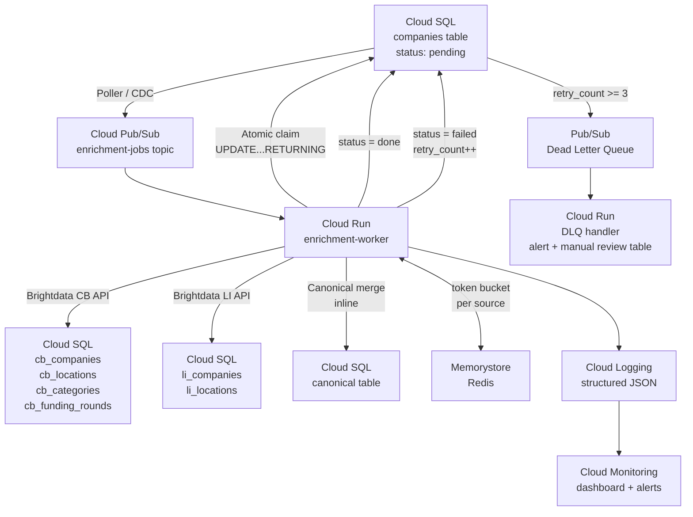

# Cloud Orchestration Guide

## Overview

This guide describes how the enrichment-and-reconcile pipeline runs as an always-on system in GCP, handling a continuously growing companies table with new rows arriving 24/7.

The local batch script (`src/main.py`) is a direct analogue — same steps, same logic — promoted to a distributed, fault-tolerant architecture with competing workers, rate limiting, and observability.

---

## Architecture



---

## How new rows get picked up

A **Cloud Scheduler** job fires every 30 seconds and calls a lightweight poller Cloud Run service. The poller queries:

```sql
SELECT id FROM companies WHERE status = 'pending' LIMIT 100;
```

For each returned ID, it publishes a message to the `enrichment-jobs` Pub/Sub topic. The poller does no enrichment itself — it only discovers and enqueues.

**Alternative (lower latency):** Use Debezium on Cloud SQL with PostgreSQL logical replication (`pg_logical`). Every INSERT/UPDATE that transitions a row to `status = 'pending'` emits a CDC event directly to Pub/Sub with sub-second latency. This removes the 30-second polling window but adds operational complexity.

For most workloads the poller is simpler and sufficient.

---

## No double-processing

Each Pub/Sub message contains only the `company_id`. When a worker picks it up, it runs an atomic claim before doing any API work:

```sql
UPDATE companies
SET status = 'claimed', claimed_by = $worker_id, claimed_at = NOW()
WHERE id = $company_id AND status = 'pending'
RETURNING id;
```

If `RETURNING` yields a row, this worker owns the job. If it returns empty, another worker already claimed it — the worker acks the message and exits. PostgreSQL row-level locking ensures only one worker wins the race.

Workers that crash mid-job leave rows stuck in `claimed`. A separate **stale-claim reaper** (Cloud Scheduler, every 5 minutes) resets rows where `claimed_at < NOW() - INTERVAL '10 minutes'` back to `pending`.

---

## Failed and unenrichable records

On any unhandled exception the worker catches, logs, and:

```sql
UPDATE companies
SET status = 'pending',
    retry_count = retry_count + 1,
    last_error = $error_message
WHERE id = $company_id;
```

After `retry_count >= 3` the row transitions to `status = 'dead'` and the worker publishes the `company_id` to a **Dead Letter Queue** Pub/Sub topic. A separate DLQ handler Cloud Run service inserts a row into `manual_review` table and triggers a PagerDuty / Slack alert.

Companies with no usable identifiers (no CB slug, no LI handle, no domain) are set to `status = 'skipped'` immediately — no API calls, no retries.

---

## Rate limiting across multiple workers

Each Brightdata source has its own token bucket in **Memorystore (Redis)**:

```
Key: rate:brightdata:crunchbase    Value: remaining tokens    TTL: 1 second
Key: rate:brightdata:linkedin      Value: remaining tokens    TTL: 1 second
```

Before calling each source, a worker runs:

```
tokens = DECR rate:brightdata:crunchbase
if tokens < 0:
    sleep until next window (PTTL rate:brightdata:crunchbase ms)
```

Bucket size is set to the per-second API limit (e.g. 10 req/s). Redis `DECR` is atomic — no coordination layer needed. If Redis is unavailable, workers fall back to a conservative local rate limit (1 req/s) rather than failing.

---

## When the canonical merge runs

The merge runs **inline at the end of each enrichment job**, before the worker sets `status = 'done'`. This keeps canonical always consistent with the latest landing data — no lag, no separate merge queue.

```
worker flow:
  1. Claim job
  2. Fetch CB data → write cb_* tables
  3. Fetch LI data → write li_* tables
  4. Run reconcile(company_id) → update canonical
  5. SET status = 'done'
```

If the canonical merge fails (e.g. data integrity error), the job retries from step 4 on the next attempt without re-fetching from Brightdata (raw data already in landing tables). This avoids unnecessary API spend on retries.

---

## Knowing the pipeline is healthy

**Cloud Monitoring dashboard — key signals:**

| Metric | Alert threshold |
|---|---|
| `pending` row count | > 500 for > 15 min — worker starvation |
| `failed` / `dead` row count | > 10 new in any 5-min window |
| No `done` transitions | 0 completions in any 15-min window — workers are stuck |
| Brightdata 429 rate | > 5% of requests — token bucket misconfigured |
| Worker p95 latency | > 90s — Brightdata slow or snapshot polling backlog |

**Structured log fields per job** (Cloud Logging):

```json
{
  "company_id": "sardine",
  "sources": ["crunchbase", "linkedin"],
  "cb_status": "ok",
  "li_status": "ok",
  "match_type": "crunchbase_slug",
  "canonical_action": "update",
  "duration_ms": 4312,
  "worker_id": "worker-abc123"
}
```

Log-based metrics feed the dashboard. An alert fires if `error_rate > 5%` over a 5-minute window, DLQ depth exceeds 10, or no jobs complete for 15 minutes. On-call receives a PagerDuty page; the Slack `#enrichment-ops` channel gets a non-paging notification for slower degradation.
